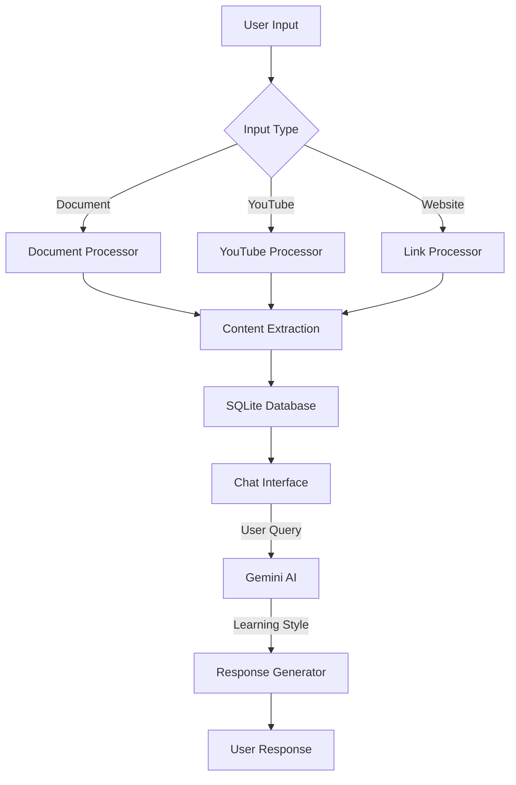

# StudyMate AI

StudyMate AI is an intelligent, chat-based study assistant that helps students understand educational content from multiple sources using Google's Gemini AI.

## Features

- Process educational content from:
  - YouTube lecture videos
  - PDFs and documents
  - Website links
- Multi-source learning with cross-referenced concepts
- Interactive chat with three learning styles:
  - Comprehensive: Detailed, structured explanations
  - Bullet Points: Concise, key information
  - Explain Like I'm 5: Simple, relatable concepts
- Source attribution for all responses


## Setup

1. Install dependencies:
```bash
pip install -r requirements.txt
```

2. Create a `.env` file in the root directory with your Google API key and model (use .env.example for reference):
```
GOOGLE_API_KEY=your_api_key_here
GEMINI_MODEL=gemini-1.5-flash
```

3. Run the application:
```bash
streamlit run app.py
```

## ⚠️ Important Notes

- **Operating System Compatibility**: Currently optimized for Windows OS only
  - YouTube processing has authentication issues on Linux systems
  - For best experience, please run the application on Windows

## Project Structure

- `app.py`: Main Streamlit application
- `src/`
  - `processors/`: Content processing modules
  - `models/`: Database models
  - `utils/`: Utility functions
  - `services/`: Core services (Gemini AI)
- `database/`: SQLite database files

## Architecture

StudyMate follows a modular architecture for processing different types of educational content:



### Key Components

- **Processors**: Convert different input types into structured content
- **Content Store**: SQLite database for efficient content retrieval
- **Chat Interface**: Streamlit-based UI with learning style selection
- **AI Engine**: Gemini AI for context-aware responses with source attribution
